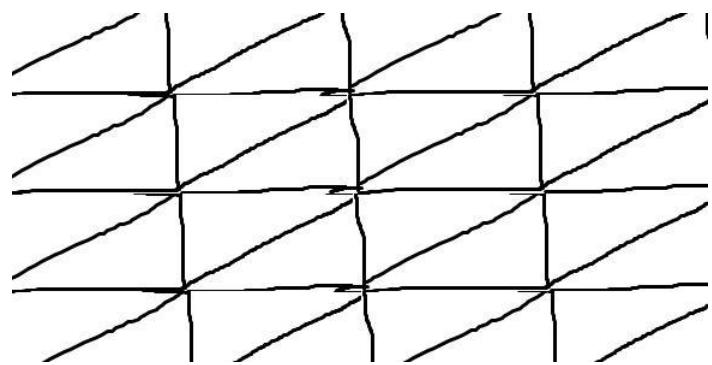

## 什么是"密铺"？

这是一个听起来有些陌生的词，但它一直存在于我们的生活中——地板、拼图、墙上的瓷砖，这些都是密铺的应用。

**密铺**（Tessellation），指用形状、大小完全相同的一种或几种平面图形进行拼接，彼此之间不留空隙、不重叠地铺成一片。这就是平面图形的密铺。

那么，密铺和多边形的内角有什么联系呢？事实上，密铺的实现离不开图形上的"角"。

## 哪些图形可以密铺？

由于本文面向初中读者，我们只讨论一种图形单独密铺的情况。

### 1. 任意三角形和任意凸四边形都可以密铺

这是两种"万能"的密铺图形——只要把两个全等三角形拼成平行四边形，平行四边形显然可以密铺。

### 2. 正多边形中，只有三种可以单独密铺

| 正多边形 | 每个内角 | 能否密铺 |
|---------|:---:|:---:|
| 正三角形 | $60^\circ$ | ✅ $6\times60^\circ = 360^\circ$ |
| 正方形 | $90^\circ$ | ✅ $4\times90^\circ = 360^\circ$ |
| 正五边形 | $108^\circ$ | ❌ $360^\circ \div 108^\circ \approx 3.33$ |
| 正六边形 | $120^\circ$ | ✅ $3\times120^\circ = 360^\circ$ |
| 正 $n$ 边形（$n \ge 7$） | $>120^\circ$ | ❌ 至少需要 3 个，但 $3 \times$ 内角 $> 360^\circ$ |

## 为什么只有这三种？

密铺的核心条件是：在每一个拼接点处，围成一周的各角之和必须恰好等于 $360^\circ$。

对于正 $n$ 边形，内角为 $\dfrac{(n-2)\times180^\circ}{n}$。若用 $k$ 个正 $n$ 边形在一点处拼接：

$$k \cdot \dfrac{(n-2) \times 180^\circ}{n} = 360^\circ$$

化简得 $(n-2)(k-2) = 4$。

这个方程只有三组正整数解：$(n,k) = (3,6), (4,4), (6,3)$——恰好对应正三角形、正方形和正六边形。

## 拓展：半正则密铺

如果允许多种正多边形混合使用，还能产生更丰富的图案（如正三角形+正方形、正三角形+正六边形等），称为半正则密铺或阿基米德密铺。有兴趣的读者可以自行探索。
