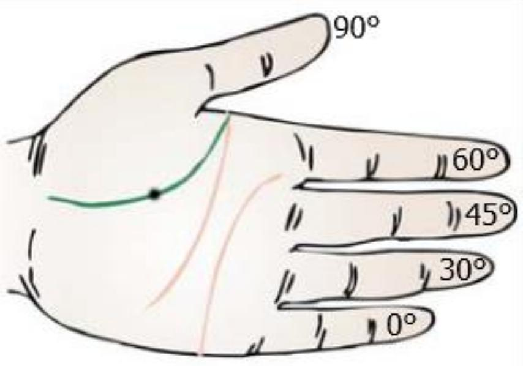

考试时突然忘了 $\sin 45^\circ$ 是多少？别慌，你的手上就写着答案。

## 手指编号

伸出你的左手，给五根手指标上角度：

| 小指 | 无名指 | 中指 | 食指 | 拇指 |
|:---:|:---:|:---:|:---:|:---:|
| $0^\circ$ | $30^\circ$ | $45^\circ$ | $60^\circ$ | $90^\circ$ |

## 用法

### 求 $\sin$ 值

例如求 $\sin 45^\circ$：
1. 找到 $45^\circ$ 对应的手指 — **中指**
2. 从中指往小指方向数，包括中指在内有几根手指？— **3 根**
3. $\sin 45^\circ = \dfrac{\sqrt{3}}{2}$

**公式**：$\sin\theta = \dfrac{\sqrt{\text{该手指左侧（含自身）的手指数量}}}{2}$

| 角度 | 左侧手指数 | $\sin$ 值 |
|:---:|:---:|:---:|
| $0^\circ$ | 0 | $\dfrac{\sqrt{0}}{2}=0$ |
| $30^\circ$ | 1 | $\dfrac{\sqrt{1}}{2}=\dfrac{1}{2}$ |
| $45^\circ$ | 2 | $\dfrac{\sqrt{2}}{2}$ |
| $60^\circ$ | 3 | $\dfrac{\sqrt{3}}{2}$ |
| $90^\circ$ | 4 | $\dfrac{\sqrt{4}}{2}=1$ |

### 求 $\cos$ 值

例如求 $\cos 60^\circ$：
1. 找到 $60^\circ$ 对应的手指 — **食指**
2. 从食指向**拇指**方向数，包括食指在内有几根手指？— **2 根**
3. $\cos 60^\circ = \dfrac{\sqrt{2}}{2} = \dfrac{1}{2}$

**公式**：$\cos\theta = \dfrac{\sqrt{\text{该手指右侧（含自身）的手指数量}}}{2}$

| 角度 | 右侧手指数 | $\cos$ 值 |
|:---:|:---:|:---:|
| $0^\circ$ | 4 | $\dfrac{\sqrt{4}}{2}=1$ |
| $30^\circ$ | 3 | $\dfrac{\sqrt{3}}{2}$ |
| $45^\circ$ | 2 | $\dfrac{\sqrt{2}}{2}$ |
| $60^\circ$ | 1 | $\dfrac{\sqrt{1}}{2}=\dfrac{1}{2}$ |
| $90^\circ$ | 0 | $\dfrac{\sqrt{0}}{2}=0$ |

### 求 $\tan$ 值

$$\tan\theta = \dfrac{\sin\theta}{\cos\theta}$$

| 角度 | $0^\circ$ | $30^\circ$ | $45^\circ$ | $60^\circ$ | $90^\circ$ |
|:---:|:---:|:---:|:---:|:---:|:---:|
| $\tan$ | $0$ | $\dfrac{\sqrt{3}}{3}$ | $1$ | $\sqrt{3}$ | 无意义 |

## 原理

这其实等价于记住 $\sin\theta = \dfrac{\sqrt{n}}{2}$ 其中 $n = 0,1,2,3,4$ 对应 $0^\circ,30^\circ,45^\circ,60^\circ,90^\circ$。手指只是帮助你在考场上不会记混方向的工具。
