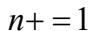

你能用几根针和一张纸估算出圆周率 $\pi$ 吗？听起来像魔术，但这是真的可以做到的——这就是经典的**蒲丰投针实验**（Buffon's Needle）。

## 实验步骤

① 取一张足够大的白纸，在上面画间距为 $a$ 的平行线

② 取一根长度为 $l$（$l \le a$）的细针（牙签也行！）

③ 将针随机投到纸上 $n$ 次，记录其中与平行线相交的次数 $m$

> 取 $l = \dfrac{a}{2}$ 最好算，这样计算结果也简洁

④ 相交频率 $P \approx \dfrac{m}{n}$

⑤ 计算 $\pi \approx \dfrac{2l}{Pa}$

当 $l = \dfrac{a}{2}$ 时，$\pi \approx \dfrac{n}{m}$——极其简洁！

## 历史实测

历史上不少数学家都亲自做过这个实验：

| 实验者 | 年份 | 投掷次数 $n$ | 相交次数 $m$ | 估计值 |
|--------|:---:|:---:|:---:|:---:|
| Wolf | 1850 | 5000 | 2532 | 3.1596 |
| Smith | 1855 | 3204 | 1218 | 3.1553 |
| Fox | 1864 | 1030 | 489 | 3.1595 |
| Lazzarini | 1901 | 3408 | — | 3.1415929 |

## 数学原理

实验背后的数学推导并不简单，涉及积分和几何概率：

在间距为 $a$ 的平行线间，随机投一根长度为 $l$ 的针，针与线相交的概率为：

$$P = \dfrac{2l}{\pi a}$$

推导思路：针的中心到最近线的距离 $x \in [0, \dfrac{a}{2}]$，针与线夹角 $\theta \in [0, \dfrac{\pi}{2}]$，相交条件是 $x \le \dfrac{l}{2}\sin\theta$。在矩形区域 $(0, \dfrac{a}{2}) \times (0, \dfrac{\pi}{2})$ 上积分求相交面积占比即可。

## 大数定律

根据频率的稳定性，实验次数 $n$ 越大，频率 $\dfrac{m}{n}$ 越接近理论概率，从而对 $\pi$ 的估计越精确。这也是**大数定律**的一个生动体现：**大量重复随机实验的频率，会稳定在理论概率附近**。
