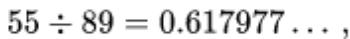

## 兔子问题

1202 年，意大利数学家斐波那契（Fibonacci）提出了一个著名问题：

> 假设一对刚出生的兔子，一个月后成熟，之后每个月生一对兔子。新生的兔子也遵循同样的规律。问第 $n$ 个月时，有多少对兔子？

| 月份 | 1 | 2 | 3 | 4 | 5 | 6 | 7 | 8 | ... |
|:---:|:---:|:---:|:---:|:---:|:---:|:---:|:---:|:---:|:---:|
| 兔子对数 | 1 | 1 | 2 | 3 | 5 | 8 | 13 | 21 | ... |

这就是**斐波那契数列**：

$$F_1 = 1, \quad F_2 = 1, \quad F_n = F_{n-1} + F_{n-2} \;(n \ge 3)$$

## 隐藏的黄金比例

将相邻两项做比：

$$\dfrac{1}{1}=1,\; \dfrac{2}{1}=2,\; \dfrac{3}{2}=1.5,\; \dfrac{5}{3}\approx 1.667,\; \dfrac{8}{5}=1.6,\; \dfrac{13}{8}=1.625,\; \dfrac{21}{13}\approx 1.615$$

你会发现这个比值越来越接近一个神秘的数字：

$$\boxed{\varphi = \dfrac{1 + \sqrt{5}}{2} \approx 1.618}$$

这就是**黄金比例**（Golden Ratio）！

数学上可以严格证明：

$$\lim_{n \to \infty} \dfrac{F_{n+1}}{F_n} = \varphi$$

## 黄金比例为什么"黄金"？

黄金比例 $\varphi = \dfrac{1+\sqrt{5}}{2}$ 满足一个优美的性质：

$$\varphi^2 = \varphi + 1$$

即 $\varphi$ 的平方等于它自己加 1。从几何上看，如果把一条线段分成 $a$ 和 $b$ 两段（$a > b$），且满足：

$$\dfrac{a+b}{a} = \dfrac{a}{b} = \varphi$$

则称这条线段被**黄金分割**。

## 自然界中的斐波那契

斐波那契数列和黄金分割在自然界中无处不在：

- 向日葵种子的螺旋排列（顺时针和逆时针的螺旋数通常是相邻的斐波那契数）
- 菠萝表皮的鳞片排列
- 鹦鹉螺壳的对数螺旋
- 树枝的分叉规律

## 斐波那契数列的性质（拓展）

- **卡西尼恒等式**：$F_{n-1}F_{n+1} - F_n^2 = (-1)^n$
- **通项公式**（比内公式）：$F_n = \dfrac{\varphi^n - (-\varphi)^{-n}}{\sqrt{5}}$
- **与组合数的关系**：$F_{n+1} = \sum_{k=0}^{\lfloor n/2 \rfloor} \dbinom{n-k}{k}$

从兔子繁殖到黄金比例，从艺术到自然界，一个简单的递推关系，串联起如此丰富的数学世界——这就是数学之美的绝佳体现。
