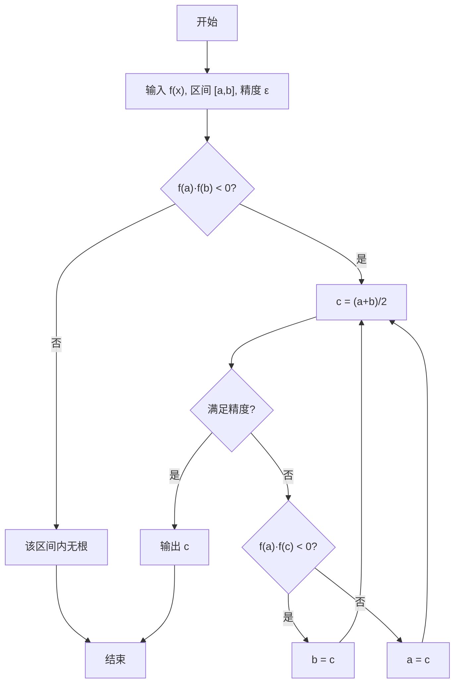

这里用来测试和演示各种交互功能。

---

## 引用测试

> 集合是不能严格定义的原始概念[^discrete]。

[^discrete]: 清华大学出版社《离散数学》，2023

---

## Mermaid 流程图：二分法求根

```mermaid
graph TD
    A["开始"] --> B["输入 f(x), 区间 [a,b], 精度 ε"]
    B --> C{"f(a)·f(b) < 0?"}
    C -->|"否"| D["该区间内无根"]
    D --> E["结束"]
    C -->|"是"| F["c = (a+b)/2"]
    F --> G{"满足精度?"}
    G -->|"是"| H["输出 c"]
    H --> E
    G -->|"否"| I{"f(a)·f(c) < 0?"}
    I -->|"是"| J["b = c"]
    I -->|"否"| K["a = c"]
    J --> F
    K --> F
```

---

## GeoGebra 交互

